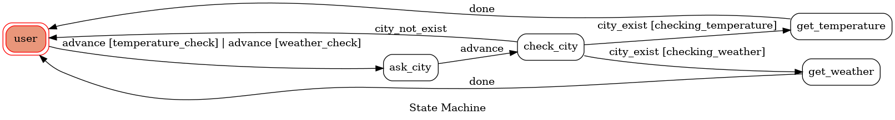

# TOC Project 2020

[](https://codeclimate.com/github/NCKU-CCS/TOC-Project-2020/maintainability)

[](https://snyk.io/test/github/NCKU-CCS/TOC-Project-2020)


Template Code for TOC Project 2020

A Line bot based on a finite state machine

More details in the [Slides](https://hackmd.io/@TTW/ToC-2019-Project#) and [FAQ](https://hackmd.io/s/B1Xw7E8kN)

## Setup

### Prerequisite
* Python 3.6
* Pipenv
* Facebook Page and App
* HTTPS Server

#### Install Dependency
```sh
pip3 install pipenv

pipenv --three

pipenv install

pipenv shell
```

* pygraphviz (For visualizing Finite State Machine)
    * [Setup pygraphviz on Ubuntu](http://www.jianshu.com/p/a3da7ecc5303)
	* [Note: macOS Install error](https://github.com/pygraphviz/pygraphviz/issues/100)


#### Secret Data
You should generate a `.env` file to set Environment Variables refer to our `.env.sample`.
`LINE_CHANNEL_SECRET` and `LINE_CHANNEL_ACCESS_TOKEN` **MUST** be set to proper values.
Otherwise, you might not be able to run your code.

#### Run Locally
You can either setup https server or using `ngrok` as a proxy.

#### a. Ngrok installation
* [ macOS, Windows, Linux](https://ngrok.com/download)

or you can use Homebrew (MAC)
```sh
brew cask install ngrok
```

**`ngrok` would be used in the following instruction**

```sh
ngrok http 8000
```

After that, `ngrok` would generate a https URL.

#### Run the sever

```sh
python3 app.py
```

#### b. Servo

Or You can use [servo](http://serveo.net/) to expose local servers to the internet.


## Finite State Machine


## Usage
The initial state is set to `user`.

Bot will wait for `user input` at first.  
When certain `keyword` is read, `fsm` will go to `ask_city` state.  
```
keywords table:
for weather checking:
"天氣", "氣象", "查詢天氣", "查詢氣象", "目前天氣", "Weather", "weather", "Get weather", "get weather"
for temperature checking:
"氣溫", "溫度", "查詢溫度", "查詢氣溫", "目前溫度", "目前氣溫", "Temperature", "temperature", "Get temperature", "get temperature"
```
Then bot will wait for another user input in `ask_city` state.
```
Allowed city names are:
"基隆","台北","臺北","新北", "桃園", "新竹", "苗栗", 
"台中", "臺中", "彰化", "南投", "雲林"
"嘉義", "台南", "臺南", "高雄", "屏東", 
"宜蘭", "台東", "臺東", "花蓮",
"澎湖", "金門", "連江"
(I am too lazy to deal with English city name, so Chinese only)
```
After user input, `fsm` will advance into `check_city` state.  
If user input is in the table above, bot will check the corresponding info on website.([link](https://www.cwb.gov.tw/V8/C/W/OBS_Map.html))  
If user input is not in the table, `fsm` will go back to initial state(`user` state).  
After `temperature` or `weather` info is sent to user, `fsm` goes back to initial state.   
* user
	* Input: See above table for keywords
		* advance to `ask_input` state
* ask_input
	* Reply: "請輸入要查詢的城市名稱"
	* wait for user input in this state
* check_input
	* If city exists:
		* advance to `states` corresponding to what info user is asking.
	* If city does not exist:
		* Reply: "此城市不存在!"
		* go back to `user` state
* get_temperature and get_weather:
	* Reply: Corresponding info on the city user asking for
	* go back to `user` state after replying message

## Deploy
Setting to deploy webhooks on Heroku.

### Heroku CLI installation

* [macOS, Windows](https://devcenter.heroku.com/articles/heroku-cli)

or you can use Homebrew (MAC)
```sh
brew tap heroku/brew && brew install heroku
```

or you can use Snap (Ubuntu 16+)
```sh
sudo snap install --classic heroku
```

### Connect to Heroku

1. Register Heroku: https://signup.heroku.com

2. Create Heroku project from website

3. CLI Login

	`heroku login`

### Upload project to Heroku

1. Add local project to Heroku project

	heroku git:remote -a {HEROKU_APP_NAME}

2. Upload project

	```
	git add .
	git commit -m "Add code"
	git push -f heroku master
	```

3. Set Environment - Line Messaging API Secret Keys

	```
	heroku config:set LINE_CHANNEL_SECRET=your_line_channel_secret
	heroku config:set LINE_CHANNEL_ACCESS_TOKEN=your_line_channel_access_token
	```

4. Your Project is now running on Heroku!

	url: `{HEROKU_APP_NAME}.herokuapp.com/callback`

	debug command: `heroku logs --tail --app {HEROKU_APP_NAME}`

5. If fail with `pygraphviz` install errors

	run commands below can solve the problems
	```
	heroku buildpacks:set heroku/python
	heroku buildpacks:add --index 1 heroku-community/apt
	```

	refference: https://hackmd.io/@ccw/B1Xw7E8kN?type=view#Q2-如何在-Heroku-使用-pygraphviz

## Reference
[Pipenv](https://medium.com/@chihsuan/pipenv-更簡單-更快速的-python-套件管理工具-135a47e504f4) ❤️ [@chihsuan](https://github.com/chihsuan)

[TOC-Project-2019](https://github.com/winonecheng/TOC-Project-2019) ❤️ [@winonecheng](https://github.com/winonecheng)

Flask Architecture ❤️ [@Sirius207](https://github.com/Sirius207)

[Line line-bot-sdk-python](https://github.com/line/line-bot-sdk-python/tree/master/examples/flask-echo)
